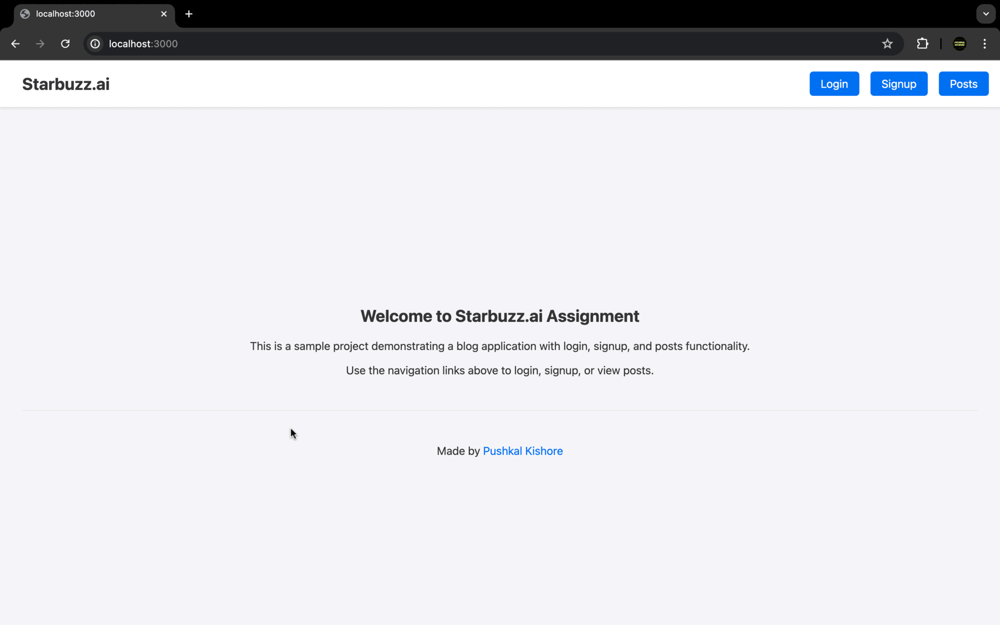

# Full-Stack Blogging Platform

This project is a full-stack blogging platform where users can sign up, log in, write blog posts. Users can view, edit, and delete their posts.

## Table of Contents

- [Features](#features)
- [Installation](#installation)
- [Usage](#usage)
- [API Endpoints](#api-endpoints)
- [Project Structure](#project-structure)
- [Project Demo](#project-demo)

## Features

- User authentication with JWT
- User login and Singup
- CRUD operations for blog posts
- Responsive and user-friendly UI

## Installation

### Prerequisites

- Node.js and npm installed on your machine
- MySQL setup

### Backend

1. Clone the repository:
   ```bash
   git clone <repository-url>
   ```
2. Navigate to the backend directory:
   ```bash
   cd starbuzz_assignment/blog-backend
   ```
3. Install dependencies:
   ```bash
   npm install
   ```
4. Set up environment variables:
   - Create a `.env` file in the `blog-backend` directory.
   - Add the following variables:
     ```env
     DB_HOST=localhost
     DB_USER=root
     DB_PASSWORD=password
     DB_NAME=starbuzz
     PORT=3001
     JWT_SECRET=your_secret_key_here
     ```
5. Start the backend server:
   ```bash
   npm run dev
   ```

### Frontend

1. Navigate to the frontend directory:
   ```bash
   cd ../blog-frontend
   ```
2. Install dependencies:
   ```bash
   npm install
   ```
3. Start the frontend server:
   ```bash
   npm run dev
   ```

## Usage

1. Open your browser and navigate to `http://localhost:3000`.
2. Sign up or log in to your account.
3. Create, edit, and delete blog posts.

## API Endpoints

### User Authentication

- `POST /api/auth/signup`: User signup
- `POST /api/auth/login`: User login

### Blog Posts

- `POST /api/posts`: Create a new post
- `GET /api/posts`: Get all posts
- `GET /api/posts/:id`: Get a single post
- `PUT /api/posts/:id`: Update a post
- `DELETE /api/posts/:id`: Delete a post

### Comments

- `POST /api/comments`: Add a comment to a post
- `GET /api/comments/:postId`: Get all comments for a post

## Project Structure

```bash
starbuzz_assignment/
├── blog-backend/
│   ├── models/
│   ├── routes/
│   ├── controllers/
│   ├── middlewares/
│   ├── .env
│   ├── server.js
│   └── package.json
└── blog-frontend/
    ├── pages/
    ├── components/
    ├── styles/
    ├── .env
    └── package.json
```

# Project Demo


